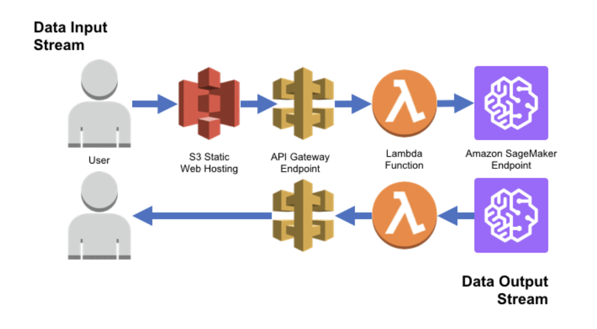

# Spam Classification

This repository contains the code and resources for a spam classification capstone project that includes both a machine learning and a deep learning solution. 
The project aims to compare the performance of these two techniques for accurately classifying email messages as spam or not spam. 

Furthermore, the best-performing model will be deployed as a static web app on AWS to provide a user-friendly interface for email spam classification.

## Table of Contents
- [Introduction](#introduction)
- [Summary of Project Features](#summary-of-project-features)
- [Getting Started](#getting-started)
  - [Prerequisites](#prerequisites)
  - [Installation](#installation)
- [Usage](#usage)
  - [Data Collection and Preprocessing](#data-collection-and-preprocessing)
  - [ML Model Training and Evaluation](#ml-model-training-and-evaluation)
  - [DL Model Training and Evaluation](#dl-model-training-and-evaluation)
- [Dataset](#dataset)
  - [Description](#description)
  - [Preprocessing](#preprocessing)
- [Feature Building](#feature-building)
  - [Statistical Vectorization](#statistical-vectorization)
  - [Distributed Representation Vectorization](#distributed-representation-vectorization)
- [Results](#results)
- [Deployment](#deployment)
  - [Input/Output Stream](#inputoutput-stream)
  - [AWS Tools Used](#aws-tools-used)
- [Acknowledgments](#acknowledgements)
- [Contact Information](#contact-information)

## Introduction

Spam messages are a common issue in communication platforms. This project explores both traditional machine learning and modern deep learning approaches to tackle the spam classification problem. By comparing the performance of these two different techniques, I aim to identify the most effective solution for accurate spam detection.

## Summary of Project Features

1. **Data Collection**: Collect and curate a labeled dataset of email messages for training and evaluation. 
2. **Text Preprocessing**: Automate text cleaning and tokenization to prepare raw text for analysis.
2. **Feature Extraction**: Extract meaningful features from text TF-IDF (Term Frequency-Inverse Document Frequency) for the ML model.
3. **Word Embedding**: Convert text into dense vector representations suitable for NLP tasks using pretrained FastText word embeddings for the DL model.
4. **Text Classification**: Implement spam classification models (one ML and one DL) to categorize the text in email messages as spam or not spam.
   - ML model: Random Forest Classifier (RF)
   - DL model: Convolutional Neural Network (CNN)

## Getting Started

### Prerequisites
To run this project, you'll need the following prerequisites:
- Python 3.10
- Keras 2.13 (with TensorFlow backend)
- scikit-learn
- NumPy
- Pandas
- Jupyter Notebook (optional for data exploration)

### Installation
1. Clone this repository to your local machine:
   ```bash
   git clone https://github.com/anastasiaarsky/production_repo.git
   ```

2. Navigate to the project directory:
    ```bash
    cd production_repo
    ```

3. Install the required Python libraries:
    ```bash
    pip install -r requirements.txt
   ```

## Usage

### Data Collection and Preprocessing  

1. The two datasets used (Spam Assassin & Enron Spam) are already located in the [`data/external_data/`](https://github.com/anastasiaarsky/production_repo/tree/main/data/external_data) directory.
2. Collect and preprocess the data by running the preprocessing script:
   ```bash 
   python -m src.data.make_dataset
   ```
   - Both the raw and preprocessed data will be saved as zipped CSV files (named `raw_data.zip` and `processed_data.zip`) in the [`data/`](https://github.com/anastasiaarsky/production_repo/tree/main/data) directory.

### ML Model Training and Evaluation 
1. Train the Random Forest model (with TF-IDF feature extraction):  
   ```bash
   python -m src.models.rf_model --train
   ```  
   - This will perform TF-IDF feature extraction on the training and validation sets and use the training set to train the model. 
   - The model will be saved in the [`models/`](https://github.com/anastasiaarsky/production_repo/tree/main/models) directory as `random_forest_model.joblib`. 
   - Evaluation metrics and a confusion matrix will be printed for the validation set.

2. Run predictions once the Random Forest model has been trained and saved:
   ```bash
   python -m src.models.rf_model
   ```  
   - This will perform TF-IDF feature extraction on the testing set and use the trained RF model that was saved in the `models/` directory for predictions. 
   - Evaluation metrics and a confusion matrix will be printed for the testing set.  
   

### DL Model Training and Evaluation   
1. Download the FastText pretrained word embeddings (`wiki-news-300d-1M-subword.vec.zip`) from the [FastText website](https://fasttext.cc/docs/en/english-vectors.html) and place them in the `data/` directory.
2. Train the CNN model (using the FastText pretrained word embeddings):  
   ```bash 
   python -m src.models.cnn_model --train
   ```  
   - This will first vectorize the training and validation sets and use them to create an embedding layer for the CNN. 
     - The tokenizer used to vectorize the training and validation sets will be saved as `tokenizer.pickle` in the [`models/`](https://github.com/anastasiaarsky/production_repo/tree/main/models) directory.
   - Then the CNN will be trained and saved as `cnn_model.h5` in the [`models/`](https://github.com/anastasiaarsky/production_repo/tree/main/models) directory.

3. Run predictions using the trained CNN model:  
   ```bash 
   python -m src.models.cnn_model
   ```  
   - This will vectorize the testing set and use the trained CNN model that was saved in the `models/` directory for predictions. 
   - Evaluation metrics and a confusion matrix will be printed for the testing set.

## Dataset

### Description
The dataset includes 39,763 entries, with 19,068 labeled as spam and 20,695 as ham (ie legitimate).

It is made up of two publicly available datasets (located in [`data/external_data/`](https://github.com/anastasiaarsky/production_repo/tree/main/data/external_data)):
- [SpamAssassin dataset](https://spamassassin.apache.org/old/publiccorpus/)
- [Enron Spam dataset](http://nlp.cs.aueb.gr/software_and_datasets/Enron-Spam/index.html) curated by [Marcel Wichmann](https://github.com/MWiechmann/enron_spam_data)

### Preprocessing

To prepare the dataset for model training, I applied these preprocessing steps to the email text:
1. Text was transformed to lowercase.
2. URLs, email addresses, and numeric values were replaced with 'url', 'email', and 'number', respectively.
3. Non-ASCII characters were removed or decoded.
4. Most punctuation was removed, only retaining essential marks like '$', '!', '.', and '?'.
5. Common stopwords were removed.
6. Extra newlines and whitespace were cleaned up.

These steps ensured clean and standardized text data, which is crucial for NLP tasks like spam detection.

You can find the raw and preprocessed datasets in the [`data/`](https://github.com/anastasiaarsky/production_repo/tree/main/data) directory. 
The code for data collection and preprocessing are located in the [`src/data/`](https://github.com/anastasiaarsky/production_repo/tree/main/src/data) directory.

## Feature Building
After applying data preprocessing techniques, I employed feature engineering methods to prepare the email text data for spam classification.

### Statistical Vectorization

For my traditional machine learning model, I used **TF-IDF** (Term Frequency-Inverse Document Frequency) vectorization to convert text data into numerical feature vectors. TF-IDF captures the importance of words in the document relative to the entire dataset.

The code for building the TF-IDF features can be found in the [`src/features/`](https://github.com/anastasiaarsky/production_repo/tree/main/src/features) directory, under `build_tfidf_features.py`.

### Distributed Representation Vectorization

For my deep learning model, I leveraged **FastText word embeddings** to represent words in a dense vector space, capturing semantic relationships between words.

The code for building the FastText features can be found in the [`src/features/`](https://github.com/anastasiaarsky/production_repo/tree/main/src/features) directory, under `build_fasttext_features.py`.


## Results

My DL model (CNN that leveraged FastText word embeddings) took slightly more CPU time to train compared to the simple ML model (Random Forest with TF-IDF). However, this difference in training time (3m 23s vs 1m 8s) was negligible considering my DL model boasted a higher accuracy (98.70% vs 98.24%), as well as a higher recall, precision, and f1 score.

Therefore, I decided to go ahead with my **CNN model** as my final model for deployment.

Below is a comparison of the two models:

| Model         | Feature Extraction Method | Training Time (CPU) | Accuracy | F1 Score | Recall | Precision |  
|---------------|---------------------------|---------------------|----------|----------|--------|-----------|
| Random Forest | TF-IDF                    | 1min 8s             | 98.24%   | 98.24%   | 98.24% | 98.24%    |
| CNN           | FastText Word Embeddings  | 3min 30s            | 98.70%   | 98.70%   | 98.72% | 98.69%    |

A more detailed report on the model selection process and results can be found in the [`reports/`](https://github.com/anastasiaarsky/production_repo/tree/main/reports) directory.

## Deployment

I have deployed this project as a static web application on AWS. Users input email text and receive a classification from my DL model of spam or ham (ie legitimate).  

### Input/Output Stream


### AWS Tools Used
1. **Amazon S3**: Hosts the web application
2. **Amazon API Gateway**: Provides serverless API to handle user requests and interact with the deployed DL model
3. **Amazon SageMaker**: Deploys the DL model and makes it accessible via the API.
4. **AWS Lambda**: Integrates the Amazon SageMaker endpoint to the front-end web app, and performs the necessary input/output processing.
5. **AWS X-Ray** and **Amazon CloudWatch**: Monitor and debug the application by allowing me to analyze application behavior, identify issues, and optimize performance.

By leveraging these AWS services, I have created a robust and scalable deployment that enables users to interact with my spam classification model through a user-friendly web interface.

For more information on model deployment architecture and step-by-step instructions, go to the [`deployment/`](https://github.com/anastasiaarsky/production_repo/tree/main/deployment) directory. 

## Acknowledgments

I'd like to express my appreciation to the following:

- **SpamAssassin Dataset and Enron Spam Dataset Contributors**: I appreciate the [SpamAssassin project](https://spamassassin.apache.org/old/publiccorpus/) and [Marcel Wiechmann](https://github.com/MWiechmann) (who created a CSV version of the [Enron Spam dataset](http://nlp.cs.aueb.gr/software_and_datasets/Enron-Spam/index.html)) for providing the spam data that was instrumental in training and evaluating my models.

- **FastText Word Embeddings**: My gratitude to the [FastText team](https://fasttext.cc/) for their word embeddings, which improved my DL model's natural language processing components.

- **Deployment Resources**: I'd like to thank the authors of the [AWS Machine Learning Blog](https://aws.amazon.com/blogs/machine-learning/deploy-trained-keras-or-tensorflow-models-using-amazon-sagemaker/), as well as Austin Lasseter for his [Medium article](https://austinlasseter.medium.com/deploy-an-nlp-classification-model-with-amazon-sagemaker-and-lambda-cd5ea6339781), as both of these resources guided me in deploying my model with Amazon SageMaker and Lambda.


I also thank the open-source community and library authors for their valuable contributions to this project.

## Contact Information
For questions or collaborations, feel free to contact me:

Email: [anarsky@gmail.com](mailto:anarsky@gmail.com)  
GitHub: [anastasiaarsky](https://github.com/anastasiaarsky)