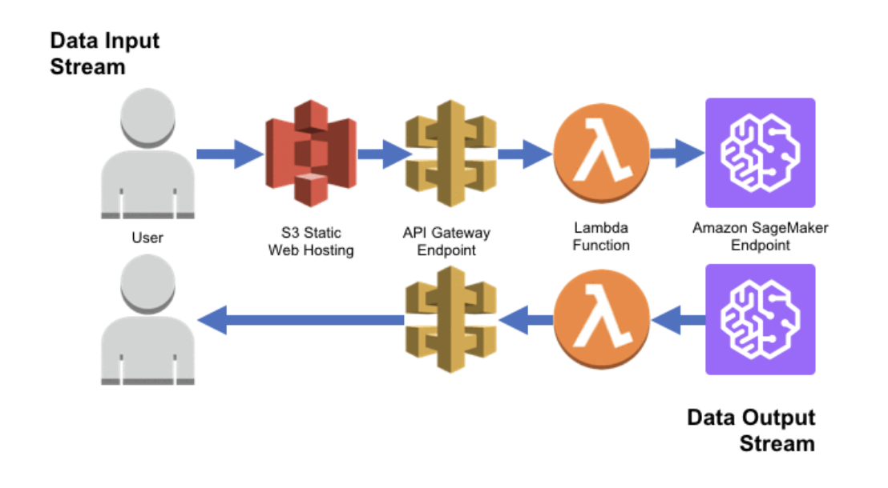

# Deployment Architecture

## General Overview:

I will be deploying my trained CNN (Keras model) in AWS as a **static web application**. Users will be able to input emails - either spam or legitimate - in the web application, and the application will return the predictions back to the user in a readable format.

## Diagram:

## Specific tools used in my system:  
- **Amazon API Gateway** for serverless API hosting,
- **Amazon S3** for hosting the web application,
- **Amazon SageMaker** for model deployment, 
- **AWS Lambda** to connect my SageMaker endpoint to my front-end web app (and do some input/output processing), and
- **AWS X-Ray** and **Amazon CloudWatch** to analyze and debug

## Inputs and Outputs:
Input: text (email to be classified)  
Output: text (classification result: spam or legitimate)    
Explanation: Users will input an email and the app will return the classification result.